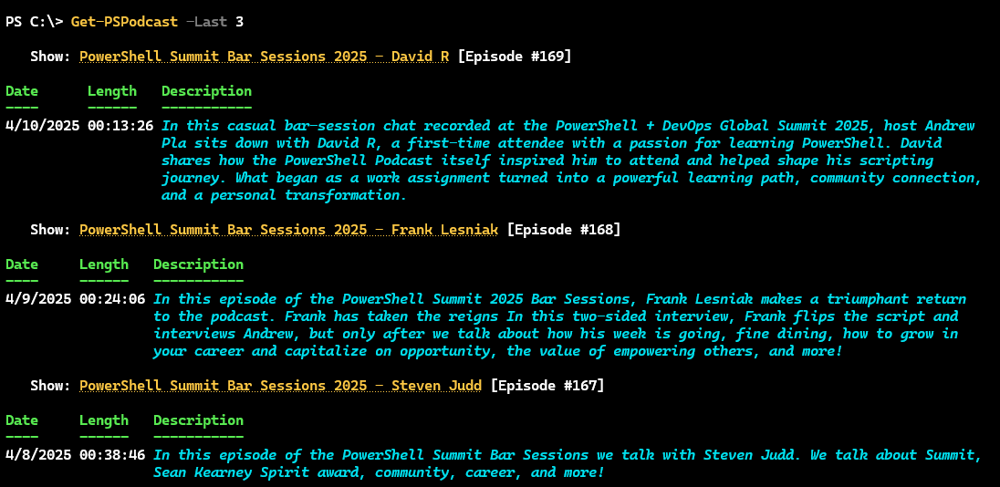
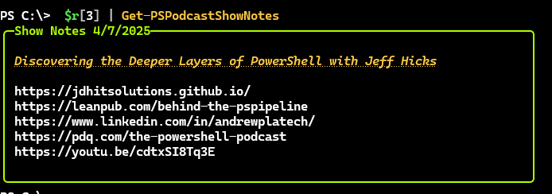
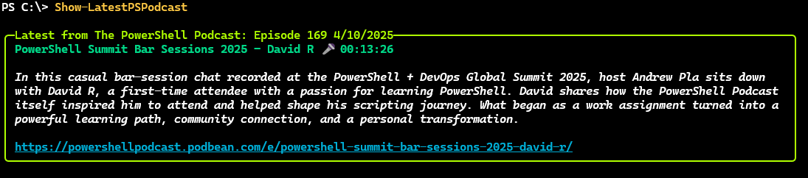
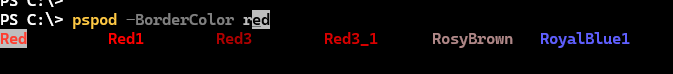
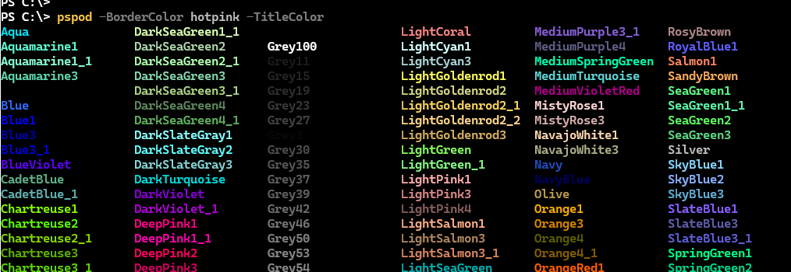
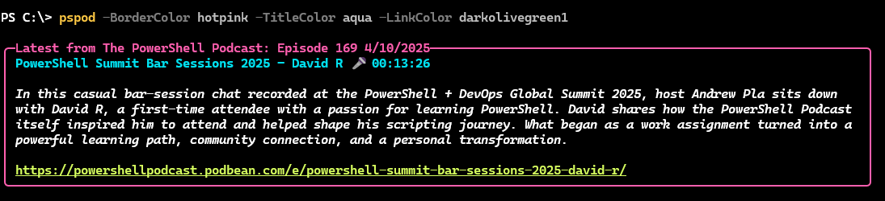

# PSPodcast

[](https://www.powershellgallery.com/packages/PSPodcast/) [](https://www.powershellgallery.com/packages/PSPodcast/)

This module requires PowerShell 7 and has a dependency on the [pwshSpectreConsole](https://github.com/ShaunLawrie/PwshSpectreConsole) module. This requirement will be installed automatically if you don't have it already.

```powershell
Install-PSResource PSPodcast
```

This is a relatively simple module designed to get and display information about recent episodes of [The PowerShell Podcast](https://powershellpodcast.podbean.com/).

> *This module is not affiliated with The PowerShell Podcast or PDQ.com.*

## [Get-PSPodcast](docs/Get-PSPodcast.md)

The `Get-PSPodcast` function will retrieve episode information from The PowerShell Podcast and display formatted results using `$PSStyle`. By default the command will retrieve the 4 most recent episodes. You can specify any value between 1 and 100.



The default output is formatted as a table using `$PSStyle`. The show title should be a clickable link. Currently, there is no way to customize the formatting. However, you can use `Format-List` to see all properties unformatted.

```powershell
PS C:\> Get-PSPodcast | Format-List

Title       : PowerShell Summit Bar Sessions 2025 - David R
Date        : 4/10/2025 5:00:00 PM
Description : In this casual bar-session chat recorded at the PowerShell +
              DevOps Global Summit 2025, host Andrew Pla sits down with David
              R, a first-time attendee with a passion for learning PowerShell.
              David shares how the PowerShell Podcast itself inspired him to
              attend and helped shape his scripting journey. What began as a
              work assignment turned into a powerful learning path, community
              connection, and a personal transformation.
Episode     : 169
Length      : 00:13:26
Online      : https://powershellpodcast.podbean.com/e/powershell-summit-bar-sess
              ions-2025-david-r/
ShowLinks   : {}
YouTube     :

Title       : PowerShell Summit Bar Sessions 2025 - Frank Lesniak
Date        : 4/9/2025 5:13:01 PM
Description : In this episode of the PowerShell Summit 2025 Bar Sessions, Frank
              Lesniak makes a triumphant return to the podcast. Frank has taken
              the reigns In this two-sided interview, Frank flips the script
              and interviews Andrew, but only after we talk about how his week
              is going, fine dining, how to grow in your career and capitalize
              on opportunity, the value of empowering others, and more!
Episode     : 168
Length      : 00:24:06
Online      : https://powershellpodcast.podbean.com/e/the-powershell-summit-bar-
              sessions-frank-lesniak/
ShowLinks   : {https://pdq.com/the-powershell-podcast,
              https://youtu.be/HoYKzgiJxkk}
YouTube     : https://youtu.be/HoYKzgiJxkk
...
```

## [Save-PSPodcast](docs/Save-PSPodcast.md)

Once you have an episode object from `Get-PSPodcast`, you can use the `Save-PSPodcast` function to download the MP3 file. The default location is `$HOME`. You can specify a different path using the `-Path` parameter.

```powershell
PS C:\> $r = Get-PSPodcast -last 5
PS C:\> $r[0] | Save-PSPodcast -Path d:\ -Passthru

    Directory: D:\

Mode                 LastWriteTime         Length Name
----                 -------------         ------ ----
-a---           4/12/2025 12:41 PM       32255999 PowerShellPodcast-169.mp3
```

The file name uses the format "PowerShellPodcast-<episode number>.mp3".

## [Get-PSPodcastShowNotes](docs/Get-PSPodcastShowNotes.md)

The `PSPodcastInfo` object includes a number of properties that point to online links. The object has a property set called `Links` which makes it easy to see all of them at once.

```powershell
PS C:\> $r[5] | Select Links

Title     : How to Build an IT Career from the Ground Up with Kevin Apolinario
            (KevTech)
Date      : 3/24/2025 10:00:00 AM
Online    : https://powershellpodcast.podbean.com/e/how-to-build-an-it-career-fr
            om-the-ground-up-with-kevin-apolinario-kevtech/
YouTube   : https://youtu.be/RrNyh6EuD_Q
ShowLinks : {https://kevtechitsupport.com, http://discord.gg/pdq,
            https://pdq.com/the-powershell-podcast,
            https://youtu.be/RrNyh6EuD_Q}
```

You can also use the `Get-PSPodcastShowNotes` function, which has an alias of `shownotes`. Pipe a previously retrieved `PSPodcastInfo` object to the command.



The output is displayed with a formatted Spectre Console panel. The title should be a clickable link to the show online. The links should also be clickable in Windows Terminal.

You can adjust the border and title colors. The parameters have tab completion for the color values. See the next section.

## [Show-LatestPSPodcast](docs/Show-LatestPSPodcast.md)

The `Show-LatestPSPodcast` function is a wrapper around `Get-PSPodcast`. It is designed to get the most recent episode. The command has an alias of `pspod`. The information is formatted using `Format-SpectrePanel` from the `pwshSpectreConsole` module.



You can customize the border, title, and link colors using any valid `Spectre.Console.Color` value. The function as an argument completer for the colo parameters. This will give you tab completion. And if you press`Ctrl+Space`, the PSReadLine module will display options formatted in the selected color.



If you press `Ctrl+Space` before specifying a color, you will be prompted and can see all available colors.



You can use any color combination to customize the display.



If you prefer a different color scheme, use `$PSDefaultParameterValues` to set them.

```powershell
$PSDefaultParameterValues['Show-LatestPSPodcast:BorderColor'] = "hotpink"
```

### Profile Integration

The `Show-LatestPSPodcast` function was created with profile integration in mind. The idea is that you can insert the command or `pspod` alias into your PowerShell profile script. Then, every time you start a new PowerShell session, the latest episode will be displayed. However, if you open new PowerShell sessions often, this might get tedious.

If you want to include the command in your profile, it is recommended you include the `-Profile` parameter.

```powershell
pspod -profile
```

This parameter will check for the existence of a flag file stored in `$HOME`.

```powershell
PS C:\> Get-Item $HOME\pspod.flag

    Directory: C:\Users\Jeff

Mode                 LastWriteTime         Length Name
----                 -------------         ------ ----
-a---           4/11/2025  8:37 AM           1124 pspod.flag
```

If the flag file exists, __and__ you use the `-Profile` parameter, the command will test the `LastWriteTime` property. If it is greater than 24 hours, the command will display the latest episode and update the flag file. If the file is less than 24 hours, the command will not display anything. This should make it possible to have the command in your profile without it displaying every time you start a new session.

Of course, you can force display by omitting the `-Profile` parameter.

If you uninstall the module you will need to manually delete the flag file.

## Road Map

I have a few more ideas in mind and there will be a few more updates in the next few weeks. If you have an enhancement suggestion or question, please use the project's [Discussion](https://github.com/jdhitsolutions/PSPodcast/discussions) board.
