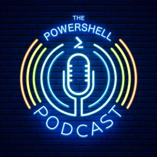
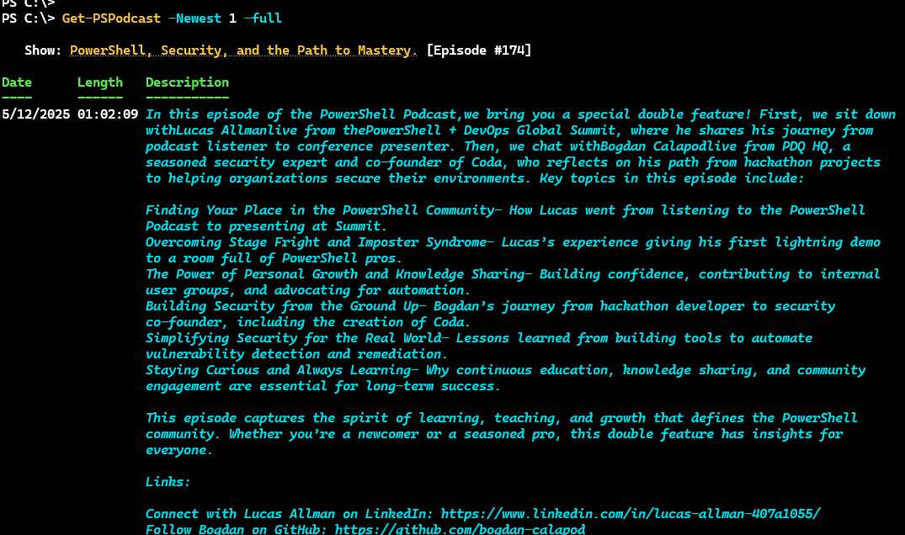
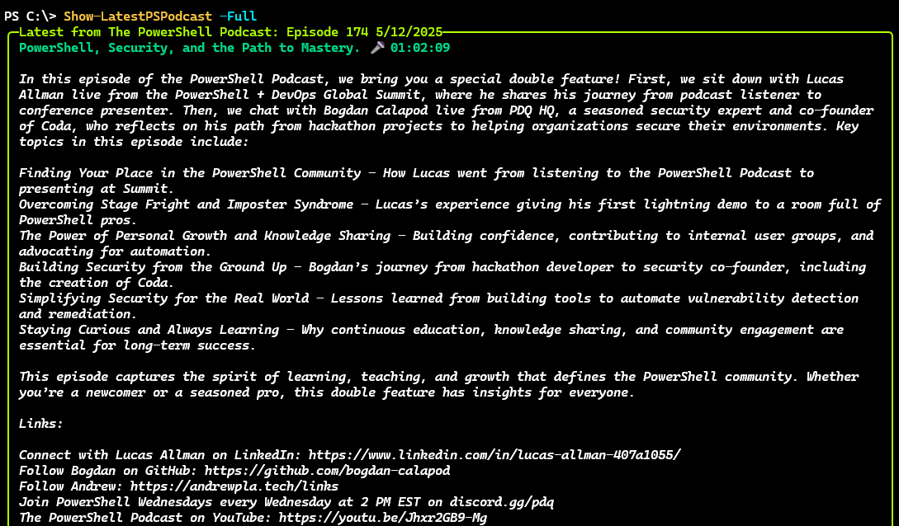
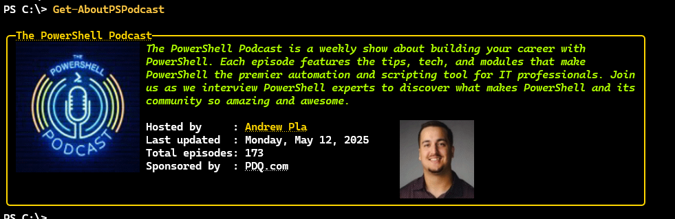
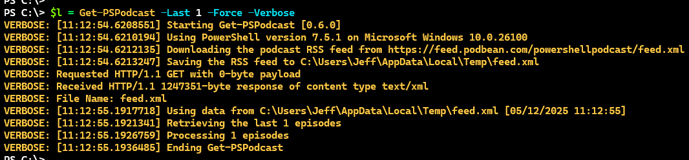

# PSPodcast

[](https://www.powershellgallery.com/packages/PSPodcast/) [](https://www.powershellgallery.com/packages/PSPodcast/)


<hr/>

This is a relatively simple module designed to get and display information about recent episodes of [The PowerShell Podcast](https://powershellpodcast.podbean.com/). The module commands are not written with automation or scaling in mind. They are designed for interactive use to display podcast information in a visually engaging way. For best results, run the commands in a terminal that supports ANSI colors and formatting, such as Windows Terminal.

This module requires PowerShell 7 and has a dependency on the [pwshSpectreConsole](https://github.com/ShaunLawrie/PwshSpectreConsole) module. This requirement will be installed automatically if you don't have it already. Install the module from the PowerShell Gallery.

```powershell
Install-PSResource PSPodcast
```

For best results, you should be using at least version 2.3.0 of the `pwshSpectreConsole` module.

> *The module may not properly render images in VSCode.*

## Module Commands

| Name | Alias | Synopsis |
|------|-------|----------|
| [Get-AboutPSPodcast](docs/Get-AboutPSPodcast.md) |  | Display podcast About information. |
| [Get-PSPodcast](docs/Get-PSPodcast.md) | *gpod* | Get recent PowerShell Podcast episode information. |
| [Get-PSPodcastModule](docs/Get-PSPodcastModule.md) |  | Get the module information for the PSPodcast module. |
| [Get-PSPodcastShowNotes](docs/Get-PSPodcastShowNotes.md) | *ShowNotes* | Get podcast show notes. |
| [Save-PSPodcast](docs/Save-PSPodcast.md) |  | Download a podcast episode |
| [Show-LatestPSPodcast](docs/Show-LatestPSPodcast.md) | *pspod* | Display the most recent PowerShell Podcast episode. |

Run `Get-PSPodcastModule` to see the module commands and their descriptions. The output is an ANSI formatted table with clickable links to the project's GitHub repository and online help.


> *__This module and its primary author are not affiliated with The PowerShell Podcast or PDQ.com__.*

## Module Import

In order to improve performance of module commands, when the module is imported, the RSS feed XML file, `feed.xml`, will be downloaded and saved to the %TEMP% folder. When you run `Get-PSPodcast`, the function will use this file instead of downloading the XML file again. However, if the file has not been found or is older than 24 hours, the XML file will be downloaded again. You can force the XML file to be downloaded again by running:

```powershell
Get-PSPodcast -Force
```

## [Get-PSPodcast](docs/Get-PSPodcast.md)

The `Get-PSPodcast` function will retrieve episode information from The PowerShell Podcast and display formatted results using `$PSStyle`. The command has an alias of `gpod`. By default the command will retrieve the 5 most recent episodes or you can specify a number of episodes.


The default output is formatted as a table using `$PSStyle`. The show title should be a clickable link. Currently, there is no way to customize the formatting. However, you can use `Format-List` to see all properties unformatted.

```powershell
PS C:\> Get-PSPodcast | Format-List

Title       : PowerShell Summit Bar Sessions 2025 - David R
Date        : 4/10/2025 5:00:00 PM
Description : In this casual bar-session chat recorded at the PowerShell +
              DevOps Global Summit 2025, host Andrew Pla sits down with David
              R, a first-time attendee with a passion for learning PowerShell.
              David shares how the PowerShell Podcast itself inspired him to
              attend and helped shape his scripting journey. What began as a
              work assignment turned into a powerful learning path, community
              connection, and a personal transformation.
Episode     : 169
Length      : 00:13:26
Online      : https://powershellpodcast.podbean.com/e/powershell-summit-bar-sess
              ions-2025-david-r/
ShowLinks   : {}
YouTube     :

Title       : PowerShell Summit Bar Sessions 2025 - Frank Lesniak
Date        : 4/9/2025 5:13:01 PM
Description : In this episode of the PowerShell Summit 2025 Bar Sessions, Frank
              Lesniak makes a triumphant return to the podcast. Frank has taken
              the reigns In this two-sided interview, Frank flips the script
              and interviews Andrew, but only after we talk about how his week
              is going, fine dining, how to grow in your career and capitalize
              on opportunity, the value of empowering others, and more!
Episode     : 168
Length      : 00:24:06
Online      : https://powershellpodcast.podbean.com/e/the-powershell-summit-bar-
              sessions-frank-lesniak/
ShowLinks   : {https://pdq.com/the-powershell-podcast,
              https://youtu.be/HoYKzgiJxkk}
YouTube     : https://youtu.be/HoYKzgiJxkk
...
```

By default, the command will only display the first paragraph of the episode description. You can use the `-Full` parameter to display the entire description.



### All

If you want to get all published episodes, use the `-All` parameter. You might want to do this if you want to perform custom filtering.

```powershell
PS C:\> Get-PSPodcast -All | Group -Property {$_.date.year} -NoElement
Count Name
----- ----
   44 2022
   53 2023
   54 2024
   29 2025

PS C:\> $all = Get-PSPodcast -all
PS C:\> $y = $all | group { $_.date.year }
PS C:\> Foreach ($item in $y) {
>>     $totalMin = ($item.Group).Length.TotalMinutes | measure -Sum
>>     [PSCustomObject]@{
>>         Year      = $item.Name
>>         Shows     = $item.Count
>>         TotalTime = New-TimeSpan -Minutes $totalMin.Sum
>>     }
>> }

Year Shows TotalTime
---- ----- ---------
2022    44 2.04:27:00
2023    53 2.10:35:00
2024    54 2.03:42:00
2025    29 22:54:00
```

### Episode

If you know the episode number, you can use the `-Episode` parameter to get a specific episode.

```powershell
PS C:\> Get-PSPodcast -Episode 160

   Show: MS Graph and Stepping into Public Speaking with Morten Kristensen
[Episode #160]

Date      Length   Description
----      ------   -----------
2/24/2025 00:33:49 In this episode of the PowerShell Podcast,we sit down withMorten Kristensen, an
                   automation specialist and PowerShell enthusiast, to discuss his journey with
                   PowerShell, his experience working with the Microsoft Graph API, and his recent
                   leap into public speaking. Morten shares insights from his first-ever technical
                   talk, the challenges of working with Graph API, and how he's navigating his
                   professional growth.
```

### Query

Finally, you can find podcast episodes with a given keyword or phrase using the `-Query` parameter. This will search the title and description of each episode. The podcast XML feed does not have a specific entry for the guest, so this is the best way to find episodes with a specific guest.

```dos
PS C:\> Get-PSPodcast -query "frank lesniak"

   Date     Length   Description
----     ------   -----------
4/9/2025 00:24:06 In this episode of the PowerShell Summit 2025 Bar Sessions, Frank Lesniak makes a
                  triumphant return to the podcast. Frank has taken the reigns In this two-sided
                  interview, Frank flips the script and interviews Andrew, but only after we talk
                  about how his week is going, fine dining, how to grow in your career and
                  capitalize on opportunity, the value of empowering others, and more!

   Show: Cross-Platform PowerShell and Sending Emails with Frank Lesniak & Neha Patil [Episode #142]

Date       Length   Description
----       ------   -----------
10/21/2024 00:50:32 In this episode of the PowerShell Podcast, we dive into the world of
                    cross-platform PowerShell with Frank Lesniak, who shares insights from his
                    recent talk at PowerShell Saturday NC. Frank explores some unique use cases for
                    PowerShell across different platforms and opens up about his interests beyond
                    the scripting language.

   Show: For the love of PowerShell and Curling with Frank Lesniak [Episode #119]

Date      Length   Description
----      ------   -----------
5/13/2024 00:33:54 In this special MMSMOA episode of the PowerShell Podcast, Andrew is joined by
                   Frank Lesniak. We touch base after PowerShell Summit, hear about tracking
                   airplanes with ADS-B and raspberry pi's. Frank talks about classes and how they
                   almost caused him to fall out of love with PowerShell. We also recount what most
                   be the most brutal display of athleticism, curling.
```

The default output will have clickable links for the show.

### Format and Type Extensions

The `PSPodcastInfo` object has a number of type extensions you might find helpful.

```powershell
PS C:\> Get-PSPodcast | Get-Member

   TypeName: PSPodcastInfo

Name         MemberType    Definition
----         ----------    ----------
Online       AliasProperty Online = Link
Equals       Method        bool Equals(System.Object obj)
GetHashCode  Method        int GetHashCode()
GetType      Method        type GetType()
ToString     Method        string ToString()
Date         NoteProperty  datetime Date=4/10/2025 5:00:00 PM
Description  NoteProperty  string Description=In this casual bar-session chat r...
DownloadLink NoteProperty  string DownloadLink=https://mcdn.podbean.com/mf/web/...
Episode      NoteProperty  string Episode=169
Length       NoteProperty  System.TimeSpan Length=00:13:26
Link         NoteProperty  string Link=https://powershellpodcast.podbean.com/e/...
ShowLinks    NoteProperty  string[] ShowLinks=System.String[]
Title        NoteProperty  string Title=PowerShell Summit Bar Sessions 2025 - D...
YouTube      NoteProperty  object YouTube=null
Links        PropertySet   Links {Title, Date, Online, YouTube, ShowLinks}
list         PropertySet   list {Episode, Date, Title}
DownloadShow ScriptMethod  System.Object DownloadShow();
```

The property sets are designed to quickly display relevant information.

```powershell
PS C:\> Get-PSPodcast -Episode 96 | Select-Object links

Title     : Code in Action: Embracing Hands-On Learning with Jeff Hicks
Date      : 12/11/2023 10:00:00 AM
Online    : https://powershellpodcast.podbean.com/e/code-in-action-embracing-hands-on-learning-w...
YouTube   : https://www.youtube.com/watch?v=lV5RXZPiM_0
ShowLinks : {https://www.youtube.com/watch?v=lV5RXZPiM_0,
            https://powershell.org/2023/11/earlybirdnowopen/,
            https://jeffhicks.substack.com/p/ask-jeff-ab8, https://devdojo.com/hcritter/powersh...}

PS C:\> Get-PSPodcast -Last 5 | Select-Object list

Episode Date                  Title
------- ----                  -----
169     4/10/2025 5:00:00 PM  PowerShell Summit Bar Sessions 2025 - David R
168     4/9/2025 5:13:01 PM   PowerShell Summit Bar Sessions 2025 - Frank Lesni...
167     4/8/2025 5:30:00 PM   PowerShell Summit Bar Sessions 2025 - Steven Judd
166     4/7/2025 10:00:00 AM  Discovering the Deeper Layers of PowerShell with ...
165     3/31/2025 10:00:00 AM From Proper Football to Databases with Jess Pomfr...
```

The module has default list and table formatted views. In addition, you can use the `list` custom table view.


The show title is clickable link.

#### Use Spectre Formatting

Finally, because this module has the `pwshSpectreConsole` module as a dependency, you can use the `Format-SpectrePanel` or `Format-SpectreTable commands to display podcast episode information.

```powershell
$show = Get-PSPodcast -episode 166
$header = "Episode #{0} - {1}" -f $show.Episode,$show.date.ToShortDateString()
$data = @"

[italic LightCoral]$($show.title)[/]

$($show.description)

[bold Yellow]NOTES:[/]
$($show.ShowLinks.foreach({"`n :right_arrow:  $($_.Trim())"}))

[DarkTurquoise]$($show.online)[/]
"@

Format-SpectrePanel -Header $header -Data $data -Color CornflowerBlue
```


```powershell
Format-SpectreTable -Title $show.Title -Data @($show.description,"`n",$show.online) -AllowMarkup -Color LightCoral -TextColor Khaki1
```


## [Save-PSPodcast](docs/Save-PSPodcast.md)

Once you have an episode object from `Get-PSPodcast`, you can use the `Save-PSPodcast` function to download the MP3 file. The default location is `$HOME`. You can specify a different path using the `-Path` parameter.

```powershell
PS C:\> $r = Get-PSPodcast -last 5
PS C:\> $r[0] | Save-PSPodcast -Path d:\ -Passthru

    Directory: D:\

Mode                 LastWriteTime         Length Name
----                 -------------         ------ ----
-a---           4/12/2025 12:41 PM       32255999 PowerShellPodcast-169.mp3
```

The file name uses the format `PowerShellPodcast-<episode number>.mp3`.

## [Get-PSPodcastShowNotes](docs/Get-PSPodcastShowNotes.md)

The `PSPodcastInfo` object includes a number of properties that point to online links. The object has a property set called `Links` which makes it easy to see all of them at once.

```powershell
PS C:\> $r[5] | Select Links

Title     : How to Build an IT Career from the Ground Up with Kevin Apolinario
            (KevTech)
Date      : 3/24/2025 10:00:00 AM
Online    : https://powershellpodcast.podbean.com/e/how-to-build-an-it-career-from-the-ground-up-...
YouTube   : https://youtu.be/RrNyh6EuD_Q
ShowLinks : {https://kevtechitsupport.com, http://discord.gg/pdq,
            https://pdq.com/the-powershell-podcast,
            https://youtu.be/RrNyh6EuD_Q}
```

You can also use the `Get-PSPodcastShowNotes` function, which has an alias of `shownotes`. Pipe a previously retrieved `PSPodcastInfo` object to the command.


The output is displayed with a formatted Spectre Console panel. The title should be a clickable link to the show online. The links should also be clickable in Windows Terminal.

You can adjust the border and title colors. The parameters have tab completion for the color values. See the next section.

## [Show-LatestPSPodcast](docs/Show-LatestPSPodcast.md)

The `Show-LatestPSPodcast` function is a wrapper around `Get-PSPodcast`. It is designed to get the most recent episode. The command has an alias of `pspod`. The information is formatted using `Format-SpectrePanel` from the `pwshSpectreConsole` module.


The default behavior is to only display the first paragraph of the episode description. You can use the `-Full` parameter to display the entire description.



You can customize the border, title, and link colors using any valid `Spectre.Console.Color` value. The function as an argument completer for the colo parameters. This will give you tab completion. And if you press`Ctrl+Space`, the PSReadLine module will display options formatted in the selected color.


If you press `Ctrl+Space` before specifying a color, you will be prompted and can see all available colors.


You can use any color combination to customize the display.


If you prefer a different color scheme, use `$PSDefaultParameterValues` to set them.

```powershell
$PSDefaultParameterValues['Show-LatestPSPodcast:BorderColor'] = "hotpink"
```

### Profile Integration

The `Show-LatestPSPodcast` function was created with profile integration in mind. The idea is that you can insert the command or `pspod` alias into your PowerShell profile script. Then, every time you start a new PowerShell session, the latest episode will be displayed. However, if you open new PowerShell sessions often, this might get tedious.

If you want to include the command in your profile, it is recommended you include the `-Profile` parameter.

```powershell
Try {
    Import-Module PSPodcast -force -ErrorAction Stop
    pspod -profile
}
Catch {
    Write-Warning $_.Exception.Message
}
```

> *Importing the module explicitly should catch any errors getting the XML feed file.*

The `-profile` parameter will check for the existence of a flag file stored in `$HOME`.

```powershell
PS C:\> Get-Item $HOME\pspod.flag

    Directory: C:\Users\Jeff

Mode                 LastWriteTime         Length Name
----                 -------------         ------ ----
-a---           4/11/2025  8:37 AM           1124 pspod.flag
```

If the flag file exists, __and__ you use the `-Profile` parameter, the command will test the `LastWriteTime` property. If it is greater than 24 hours, the command will display the latest episode and update the flag file. If the file is less than 24 hours, the command will not display anything. This should make it possible to have the command in your profile without it displaying every time you start a new session.

You can force display of the latest show by omitting the `-Profile` parameter.

__If you uninstall the module you will need to manually delete the flag file.__

## [Get-AboutPSPodcast](docs/Get-AboutPSPodcast.md)

This is a simple command to display summary information about The PowerShell Podcast. This information is pulled from the podcast's RSS feed. The output is a formatted Spectre console panel with clickable links.



## Module Features

This module uses PowerShell more as a presentation interface than as a management tool. In addition to the obvious formatting features from the pwshSpectreConsole module, the module has a few other features you might find useful.

Module commands are written with verbose output.



To aid in troubleshooting, some commands also support the information stream and will write additional information to the information stream.

```powershell
PS C:\> $l = Get-PSPodcast -Last 1 -InformationVariable iv
PS C:\> $iv | Select-Object *

MessageData     : #document
Source          : C:\scripts\PSPodcast\functions\Get-PSPodcast.ps1
TimeGenerated   : 5/12/2025 11:16:52 AM
Tags            : {raw}
User            : PROSPERO\Jeff
Computer        : Prospero
ProcessId       : 31156
NativeThreadId  : 31352
ManagedThreadId : 18

MessageData     : item
Source          : C:\scripts\PSPodcast\functions\Get-PSPodcast.ps1
TimeGenerated   : 5/12/2025 11:16:52 AM
Tags            : {raw}
User            : PROSPERO\Jeff
Computer        : Prospero
ProcessId       : 31156
NativeThreadId  : 31352
ManagedThreadId : 18
```

I use this to aid in development. You might want to use it for troubleshooting or your own development should you for this module.

```powershell
PS C:\> $iv[0].MessageData

xml                            #comment                  rss
---                            --------                  ---
version="1.0" encoding="UTF-8"  generator="podbean/5.5"  rss

PS C:\> $iv[0].messageData.rss.channel

title           : The PowerShell Podcast
link            : {atom:link, https://powershellpodcast.podbean.com}
description     : The PowerShell Podcast highlights what makes PowerShell so great, the community.
                  Each week we want to highlight people, blogs, videos, and modules that have gone into making PowerShell so great.
pubDate         : Mon, 12 May 2025 08:00:00 -0600
generator       : https://podbean.com/?v=5.5
language        : en
countryOfOrigin : us
copyright       : Copyright 2022 All rights reserved.
category        : {Technology, itunes:category}
ttl             : 1440
type            : episodic
summary         : The PowerShell Podcast highlights what makes PowerShell so great, the community.
                  Each week we want to highlight people, blogs, videos, and Galleries that have gone into making PowerShell so great.
author          : PDQ.com
owner           : owner
block           : No
explicit        : false
image           : {itunes:image, image}

PS C:\> $iv[1].MessageData

title       : {PowerShell, Security, and the Path to Mastery., PowerShell, Security, and the Path
              to Mastery.}
link        : https://powershellpodcast.podbean.com/e/powershell-security-and-the-path-to-mastery/
comments    : https://powershellpodcast.podbean.com/e/powershell-security-and-the-path-to-mastery/
              #comments
pubDate     : Mon, 12 May 2025 08:00:00 -0600
guid        : guid
description : description
encoded     : encoded
enclosure   : enclosure
summary     : summary
author      : PDQ.com
explicit    : false
block       : No
duration    : 01:02:09
episode     : 174
episodeType : full
```

## Road Map

If you have an enhancement suggestion or question, please use the project's [Discussion](https://github.com/jdhitsolutions/PSPodcast/discussions) board.
